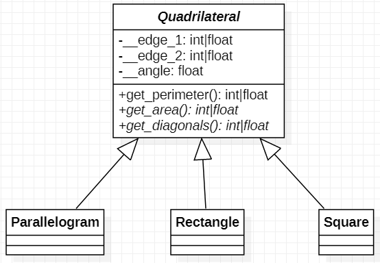

# 練習 2 － 四邊形
在本章節中，我們會利用同種類的特殊四邊形練習物件導向「繼承」（**Inheritance**）與「**多型**」（**Polymorphism**）。

## 情境說明
四邊形有許多種類，在這邊我們只討論「最多只有兩種邊長」的凸四邊形，
符合這個條件的有「長方形」、「正方形」、「平行四邊形」、「菱形」與「箏型」。
在得知兩邊長與夾角，我們可以計算出這些四邊形的周長、面積與 2 條對角線的長度。

在這個練習中，我們的類別將會有以下的階層關係：
- 四邊形（Quadrilateral）
    - 平行四邊形（Parallelogram）
    - 長方形（Rectangle）
    - 正方形（Square）



## 設計要求
### Step 1. 建立抽象類別 `Quadrilateral`
`Quadrilateral` 包含以下的 Instance Attributes：
- `__edge_1: int|float`: 四邊形第一個邊的邊長，該數值應大於 0。
- `__edge_2: int|float`: 四邊形第二個邊的邊長，該數值應大於 0。
- `__angle: int|float`: 四邊形兩個編所夾出來的角度，單位為徑度。

請宣告其 Constructor 的傳入值格式為 `(edge_1, edge_2, edge_3)`

`Quadrilateral` 包含以下的 Instance Methods：
- `get_perimeter() -> int|float`: 回傳四邊形的周長。

**繼承**（**Inheritance**）是對一個類別做功能上的擴充，
例如我們討論的四邊形的鞭長計算方式都是兩個邊長總和的 2 倍的，
因此我們在 `Quadrilateral` 實作 `get_perimeter()` ，這樣可以減少重複的程式碼；
當然若有需要，我們也可以在子類別中去覆寫（Override）原本的方法。

若有多個類別中有類似功能的 methods（input 和 output 格式一樣），
我們會把這些 methods 抽到一個類別再繼承下來實作，
將 methods 抽到父類別（Superclass）的過程叫做**抽象化**（**Abstraction**），
像是所有我們討論的各種四邊形面積計算方式都不一樣，所以把 `get_area()` 提升到父類別 `Quadrilateral`；
而由不同的子類別（Subclass）完成 methods 實作不同的過程就是**多型**（**Polymorphism**）的精神。

> [!NOTE] 
> 一個類別若包含抽象方法（Abstract Methods）則該類別為**抽象類別**（**Abstract Class**），
> 抽象類別中的抽象方法必須在子類別中實作
> 
> 在 Python 中會利用 `abc.ABCMeta` 定義抽象類別並用裝飾子（decorator）去定義抽象方法。
> 其語法如下：
>
> ``` python
> from abc import ABCMeta, abstractmethod
> class MyAbstractClass(metaclass=ABCMeta)
>     ....
>     @abstractmethod
>     def an_abstract_method(self, ...):
>         pass
> ```
> 若你嘗試將一個抽象類別實例化，你會得到 `TypeError`。

請宣告以下的**抽象方法**（**Abstract Instance Methods**）：

- `get_area() -> int|float`: 計算四邊形的面積。
- `get_diangonals() -> tuple`: 回傳 2 個對角線的長度。

繼承的機制中，只有不屬於私有的屬性與方法（在 Python 只有分公開和私有）才能被子類別直接存取，
因此我們必須要有 getter 和 setter 才能對私有的屬性做存取。
> [!NOTE]
> 在 Python 中可利用裝飾子 `property` 讓存取的呼叫變得更簡潔，
> 範例程式碼如下：
> ``` python
> class A:
>     def __init__(self):
>         self.__x = 5
>     @property
>     def x(self):
>         return self.__x
>     @x.setter
>     def x(self, n):
>          if n >= 0: self.__x = n
> 
> # 存取的範例
> a = A()
> print(a.x)
> a.x = 3
> ```

> [!CAUTION]
> 在 Python 中，雖然你可以利用 `x._MyClass__a1` 去直接存取 `x.__a1`，
> 然而這樣會違背「封裝」的原則，比較好的方式還是寫 `property` 控制存取的方式。

請利用 `property` 完成 `__edge_1`、`__edge_2`、`__angle` 的 **Getter**。


### Step 2. 完成類別 `Parallelogram`
將 `Parallelogram` 繼承 `Quadrulateral`。
> [!NOTE]
> Python 中繼承的語法如下。
> ```python
> class Superclass:
>     ...
> class Subclass(Superclass):
>     ...
> ```
> 若沒有將 Methods/Constructor 覆寫，會呼叫父類別的 Methods/Constructor。

將父類別的抽象方法實做出來：
- `get_area() -> intfloat`: 平行四邊形的面積。
- `get_diagonals() -> tuple`: 平行四邊形的兩條對角線長度。

> [!TIP]
> 令平行四邊形的兩邊為 a, b、夾角為 $\theta$，對角線 $d_1, d_2$，則：
> - 面積 = $ab\sin{\theta}$
> - 依照三角形餘弦定理，$d_1 = \sqrt{a^2 + b^2 - 2ab\cos\theta}$，
>   $d_2 = \sqrt{a^2 + b^2 + 2ab\cos\theta}$

> [!IMPORTANT]
> 你需要利用在 `Quadrilateral` 定義的 `property` 取得邊長和角度的資訊。


### Step 3. 完成 `Rectangle`
將 Rectangle 的 Constructor 覆寫成輸入為 `(edge_1, edge_2)`，利用 `super().__init__(...)` 將父類別的 `__edge_1, edge_2, __angle` 初始成 `edge_1, edge_2, pi/2`。
> [!NOTE]
> 具體來講，會像是這個樣子，`super()` 表示調用父類別的 method，
> 在這個例子中就是調用 Quadrilateral 的 Constructor。
> ```python
> class Rectangle(Quadrilateral):
>     def __init__(self, edge_1, edge_2):
>         super().__init__(edge_1, edge_2, math.pi/2)
> ```

將父類別的抽象方法實做出來：
- `get_area() -> intfloat`: 長方形的面積。
- `get_diagonals() -> tuple`: 長方形的兩條對角線長度。


### Step 4. 完成 `Square`
將 Rectangle 的 Constructor 覆寫成輸入為 `(edge)`，利用 `super().__init__(...)` 將父類別的 `__edge_1, edge_2, __angle` 初始成 `edge, edge, pi/2`。

將父類別的抽象方法實做出來：
- `get_area() -> intfloat`: 長方形的面積。
- `get_diagonals() -> tuple`: 長方形的兩條對角線長度。

利用 `property` 新增 Getter `edge`，該方法會回傳父類別的 `__edge_1`。

## 部分程式碼
```python
from abc import ABCmeta, abstractmethod

class Quadrilateral(metaclass=ABCMeta):
    def __init__(self, edge_1, edge_2, angle):...
    ...
    @abstractmethod
    def get_area(self):
        ...


class Parallelogram(Quadrilateral):
    def __init__(self, edge_1, edge_2, angle):
        super().__init__(edge_1, edge_2, angle)

class Rectangle(Quadrilateral):
    ...

class Square(Quadrilateral):
    ...


if __name__ == '__main__':
    # 每個圖形各建立一次，看面積與對角線長度。
    ...
```