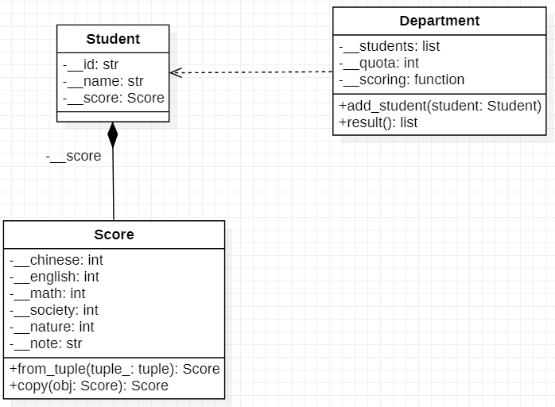

# 練習 3 - 入學申請
## 練習目標
- 能了解 UML 類別圖與程式碼之間的關係。
## 情境說明
學測放榜，考生們開始填寫校系志願，各校系都有不同的成績加成方法與錄取人數。
學院端需要做的事有：
- 收取考生的志願申請。
- 將考生的成績單進行加權做排序。
- 公布錄取名單。

在這個練習中，假設入學分數只會依據學測分數進行加權決定錄取。
## 檔案結構
本次的練習分成三個檔案：
```
p3
├-- student.py
├-- college.py
├-- main.py
└-- data
    ├-- college.json
    └-- student.json
```
- `student.py`: 定義 `class Student` 與 `class Score`。
- `college.py`: 定義 `class College` 與其子類別。
- `main.py` ： 用來模擬主要流程。

## 程式設計
### UML 類別圖


### Step 1. 完成 `student.py`
#### 1.1 完成 `class Score`
定義 `class Score`，該類別具有以下的 **Instance Attributes**:
- `__chinese: int`: 國文的分數。
- `__english: int`: 英文的分數。
- `__math: int`: 數學的分數。
- `__society: int`: 社會的分數。
- `__nature: int`: 自然的分數。
- `__note: str`: 成績單的備註，預設為 `''`。

`class Score` 具有以下的**類別屬性**(**Class Methods**)
- `from_tuple(tuple_: tuple) -> Score`: 依照 `tuple_` 製造 `Score` 物件。
  `tuple_` 的元素第 0~4 項依序代表 `chinese`, `english`, `math`, `society`, `nature` 的成績；
  若有第 5 項則該項代表 `note`。

- `copy(obj:Score) -> Score`: 將 `Score` 的物件進行**深拷貝**(**deep copy**)回傳。

> [!NOTE] 
> Python 的**類別方法**用來定義與實體無直接關係、但與類別有關係的方法。
> 宣告類別方法需要用 `@classmethod` 裝飾：
> ```python
> class MyClass:
>     ...
>     @classmethod
>     def a_class_method(cls, ...):
>         ...
> 
> MyClass.a_class_method(...)
> ```
> 由於 Python 的語言特性的關係，類別方法常用於建構子的擴充。
> 下面的範例 `MyClass.__init__()` 有 3 個引數，
> 其中的 `from_tuple` 可以利用包含 3 個元素的 tuple 生成物件。
> ```python
> class MyClass:
>     def __init__(self, arg_1, arg_2, arg_3):
>         ...
>     
>     # an example of making `Myclass` object by a tuple
>     # assert that the tuple has 3 arguments
>     @classmethod
>     def from_tuple(cls, tuple_):
>         obj = cls(*tuple_)
>         return obj
> 
> tuple_ = (1, 2, 3)
> obj = MyClass.from_tuple(tuple_)
> ```
> 將物件中的所有屬性的值都複製給新的物件的動作稱為「深拷貝」（Deep Copy）。

參考下表，利用 `@property` 定義出相對應的 getter/setter。
|property |attribute  |getter|setter|
|---------|-----------|------|------|
|`chinese`|`__chinese`| O    | X    |
|`english`|`__english`| O    | X    |
|`math`   |`__math`   | O    | X    |
|`society`|`__society`| O    | X    |
|`nature` |`__nature` | O    | X    |
|`note`   |`__note`   | O    | X    |

當你完成時，應該會長得像這個樣子
```python
class Score:
    def __init__(self, chinese, english, math, society, nature, note=''):
        ...

    @classmethod
    def copy(cls, obj):
        ...

    ...
```

#### 1.2 完成 `class Student`
`class Student` 有以下的 **Instance Attributes**
- `__id: str`: 准考證號碼。
- `__name: str`: 考生性名。
- `__score: Score`: 考生的成績。

> [!TIP]
> 在這個練習中，`Score` 的實體**複合** (**Composition**) 到 `Student`，
> 意味著 `Score` 物件的生命週期與 `Student` 一樣。
> 
> 在英文的語感為 "class `Student` owns class `Score`"。

`Student` 具有下列的 **Class Methods**:
- `from_score_tuple(id: str, name: str, tuple_: tuple) -> Student`: 依照 `tuple_` 製造 `Student` 物件。
  `tuple_` 的元素第 0~4 項依序代表 `score.__chinese`, `score.__english`, `score.__math`,
  `score.__math`, `score.__society`, `score.__nature`；
  若有第 5 項則該項代表 `score.__note`。

- `from_score(id: str, name: str, score: Score) -> Student`: 利用 `Score` 實體建立 `Student` 實體。

`class Student` **複寫** (**Override**) 以下的實體方法：
- `__str__() -> str`: 以字串回傳考生資訊。字串的格式如下：

```
===================
Score of GSAT
-------------------
Name: student_name
  Id: 11300000

Chinese: 11
English: 9
   Math: 13
Society: 8
 Nature: 10
===================
```

> [!NOTE]
> 前後雙底線在 python 中具有特殊意義，通常代表 Python 核心所提供的功能。
> 例如 `__add__` 定義 `+` 的使用、`__eq__` 定義 `==` 的使用。
> `__str__` 定義為「該物件的字串輸出」，事實上在執行 `str(obj)` 與 `print(obj)` 時
> 就等同於執行 `obj.__str__()` 與 `print(obj.__str__())`。
>
> 以下範例會印出 `__a`, `__b` 的值：
> ```python
> class MyClass:
>     def __init__(self, a, b)
>         self.__a, self,__b = a, b
> 
>     def __str__(self):
>         return '__a: %d, __b: %d'%(self.__a, self.__b)
> 
> print(MyClass(1, 2))
> # Output: "__a: 1, __b: 2"
> ```

參考下表，利用 `@property` 定義出相對應的 getter/setter。
|property   |getter               |setter|
|-----------|---------------------|------|
|`id`       |`__id`               | X    |
|`name`     |`__name`             | X    |
|`score`    |the copy of `__score`| X    |
|`chinese`  |`__score.chinese`    | X    |
|`english`  |`__score.english`    | X    |
|`math`     |`__score.math`       | X    |
|`society`  |`__score.society`    | X    |
|`nature`   |`__score.nature`     | X    |

> [!CAUTION]
> 被複合的對象定義為私有，若在 getter 直接回傳
> 會讓其資訊以公開曝露造成**私有外洩** （**Privacy Leak**）。
> 將被聚合對象深拷貝在回傳複本可以解決私有外洩的問題。
>
> 範例為 A 複合 B，以下程式碼有私有外洩的問題。
> ```python
> class A:
>     ...
> 
> class B:
>     def __init__(self):
>         self.__a = A(...)
> 
>     @property
>     def a(self): return self.__a
> ```
>
> 以下用深拷貝作為解決方案。
> ```python
> class A:
>     ...
>     @classmethod
>     def copy(cls, obj):
>         # deep copy
>         a = obj.a
>         ...
>     return cls(a, ...)
>
> class B:
>     def __init__(self):
>         self.__a = A(...)
> 
>     @property
>     def a(self): return A.copy(self.__a)
> ```

#### 1.3 在 `student.py` 撰寫 `if __name__ == '__main__`:
在 `if __name__ == '__main__` 中，請依流程執行：
1. 利用 `Score.__init__()` 建立 `score_1`。
2. 利用 `Score.copy()` 將 `score_1` 生拷貝到 `score_1_copy`。
3. 將 `score_1` 和 `score_1_copy` 直接印出來；由於沒有覆寫 `__str__`，
   應該會列印物件的記憶體位置：
   ```
   <__main__.Score object at 0x000001F58E733F50>
   ```
4. 利用 `Score.from_tuple()` 建立 `score_2`
5. 利用 `Student.__init__()`